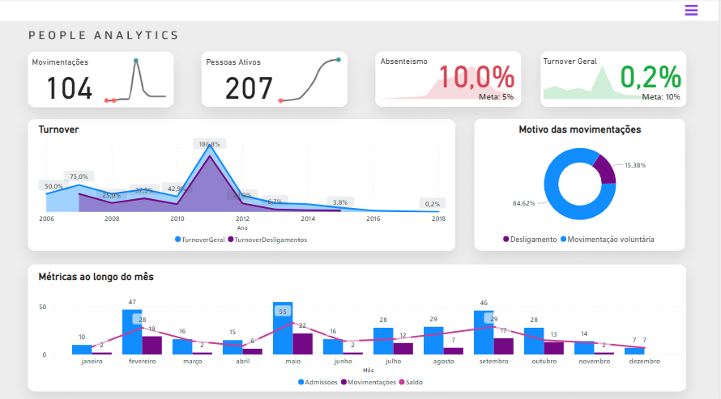
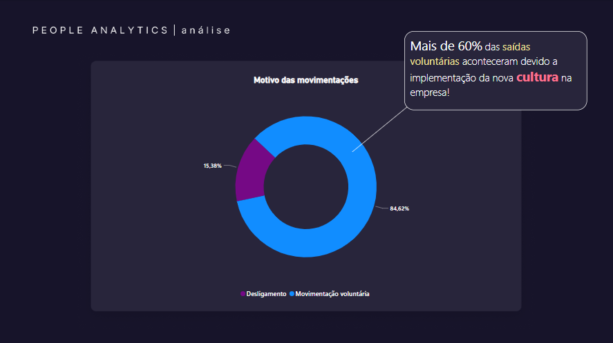
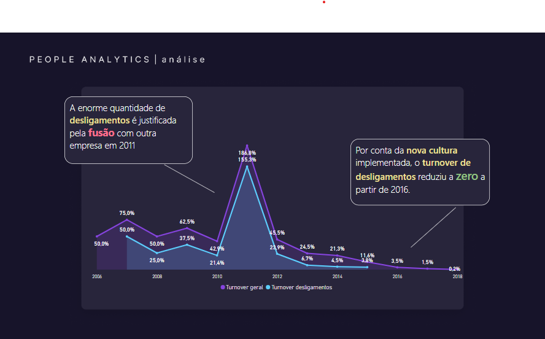
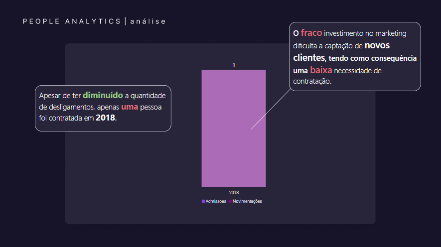

# People Analytics - Power BI

Projeto de análise de dados com Power BI, para criação de um relatório para o RH de uma empresa ficticia para visualizar os dados de funcionarios, focando na análise de adimissões e desligamentos ao longo do tempo.

## Dashboard

## Apresentações

## Tópicos abordados durante esse projeto:
* Conheça diferentes funcionalidades do Power BI Desktop para montar um relatório personalizado
* Aprenda a configurar um tema para padronizar cores e família de fontes
* Entenda como formular uma pergunta para o Power BI sugerir uma visualização baseada nos seus dados
* Realize a previsão e localização de anomalias em série temporais no relatório Power BI
* Compreenda como a análise automatica do Power BI pode explicar flutuações nos gráficos
* Estruture uma apresentação dinâmica com um relatório Power BI
* Aplique alternativas de acessibilidade para os relatórios construídos em Power B

 

 

<h3>Contribuindo</h3>

⭐️ Star o projeto

🐛 Encontrar e relatar issues